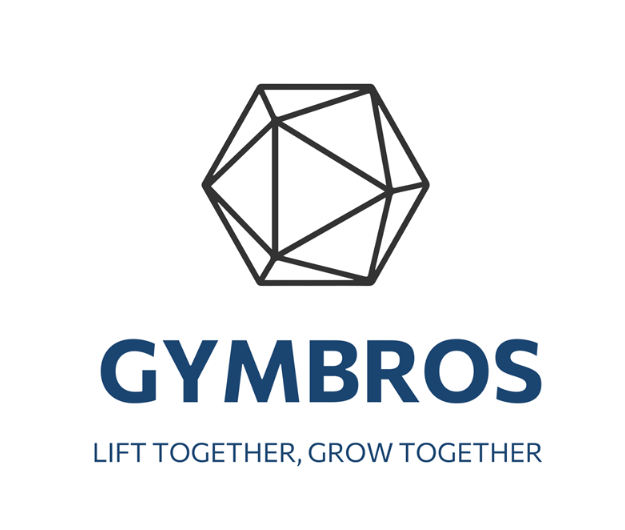

# GYM AI - Smart Fitness Application

<p align="center">
  
</p>

GYM AI is a comprehensive fitness tracking and community connection application that helps users manage workouts, nutrition, and connect with other fitness enthusiasts. Powered by AI technology, it provides personalized recommendations based on your fitness goals and performance.

## ✨ Features

- **User Authentication & Profile Management**

  - Create and manage your fitness profile
  - Track your progress over time
  - Set personal goals and objectives

- **Workout Tracking & Planning**

  - Create custom workout routines
  - Log your exercises, sets, and repetitions
  - Get AI-powered workout suggestions

- **Nutrition Analytics**

  - Log food intake and analyze nutrients
  - Track calories and macronutrients
  - Get diet recommendations based on your goals

- **Progress Visualization**

  - Beautiful charts and graphs to visualize progress
  - Milestone tracking and achievements
  - Data-driven insights into your fitness journey

- **Community Integration**
  - Connect with other fitness enthusiasts
  - Share your achievements and routines
  - Get motivation from the community

## 🛠️ Technologies Used

### Frontend Frameworks

- **Bootstrap 5** - Responsive interface and grid system
- **AOS (Animate On Scroll)** - Scroll animation effects
- **Chart.js** - Data visualization for progress tracking
- **Font Awesome** - Rich icon library
- **SweetAlert2** - Beautiful JavaScript alerts

### Development Tools

- **Vite** - Fast development server and optimized builds
- **NPM** - Package management
- **Lite Server** - Lightweight server for development

## 🚀 Getting Started

### Prerequisites

- Node.js (v14.0 or higher)
- NPM (v6.0 or higher)

### Installation

1. Clone the repository:

```bash
git clone https://github.com/hoangno1st/GYM_AI.git
cd GYM_AI
```

2. Install dependencies:

```bash
npm install
```

3. Run setup:

```bash
npm run setup
```

### Running the Application

Development mode:

```bash
npm run dev
```

Or using lite-server:

```bash
npm start
```

### Building for Production

To create a production build:

```bash
npm run build
```

The output will be stored in the `dist` directory.

## 🔍 Project Structure

- `index.html` - Login/Registration page
- `home.html` - Main dashboard
- `workouts.html` - Workout tracking
- `nutrition.html` - Nutrition tracking
- `profile.html` - User profile
- `settings.html` - Settings
- `*.js` - JavaScript files for each page
- `*.css` - CSS files for each page

## 🛟 Troubleshooting

1. **"Cannot run" error**:

   - Check if Node.js is installed: `node -v`
   - Make sure you've run `npm install` to install libraries
   - If encountering issues with Vite, try `npm start` to run lite-server

2. **Logo not displaying**:

   - Ensure logo.png is in the images directory
   - If missing, add a logo image to the directory

3. **Animations not working**:
   - Check console for errors
   - Ensure AOS is initialized in the JS file

## 👥 Contributors

- [Hoang No 1st](https://github.com/hoangno1st)

## 📄 License

This project is licensed under the MIT License - see the LICENSE file for details.

## 🙏 Acknowledgements

- Thanks to all the open-source libraries that made this project possible
- Special thanks to our mentors and advisors for their guidance
